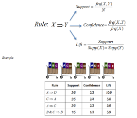
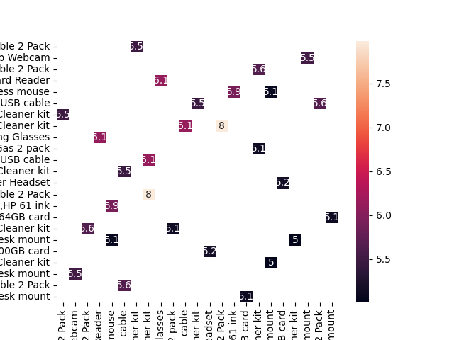

# Market Basket Analysis

## Maintainer: 

data.is4life@gmail.com

## Environment: 

This analysis was initially built in a Jupyter Notebook, but has been adapted into a web application using Streamlit. The Docker image is built from Python 3.9.16 slim buster and the requirements are imported via the requirements.txt file inclused in this package. The written analysis is based on the telco_market_basket.csv file included in this package, but shows the ability of the application to accept a frequently generated csv file with these features for monthly or quarterly analysis. The application includes a file drop window to easily accomodate this scenario.

## Instructions:

With all files included in a folder, navigate and open the folder in a terminal. With Docker running, the following code should be run to build the Docker container with the image. 

docker build -t market_basket:v1 .

Once the container is built, it is opened and the analysis is run using the following code:

docker run -d -p 8501:8501 market_basket:v1

## Overview:

In data analysis, finding patterns in data is common theme. Pattern detection can enable the evaluator to see trends in the data and give recommendations for changing or strengthening that pattern. This analysis will use the market basket analysis method to predict patterns in the telecommunication component data gathered.
This analysis method searches for product combinations that are frequently purchased together. This method benefits from using larger data sets so that more transactions can be compared and produce more accurate results. Market basket analysis uses association rules to calculate the relationship between products. The product is a rule, which consists of an antecedent and a consequent. These are just lists of items that are purchased by a customer, with the antecedent occurring first and the consequent being a co-occurrence in the transactions. An itemset or set of items in the antecedent and consequent, is produced for every rule.
The components of the association rule are calculated to analyze the itemset. Those components are support, confidence, and lift. Support is how often the itemset appears in the data. Support is calculated by dividing the number of transactions with the itemset by the total number of transactions. Confidence calculates if the itemset is popular with individual or combined sales. Confidence is calculated by dividing the combined transactions by the individual transactions. Lift is the ratio between confidence and support and tells the likelihood of both items being bought together. A diagram of how the association rules of market basket analysis is shown to visualize these calculations.

## Research Question and Purpose:

A telecommunications company is attempting to understand their customer base in a more detailed manner. The company has a data set containing customer transactions for products that they offer to customers and would like to figure out which products the customers’ favor. A market basket analysis on the data set will be conducted to produce this information.
The analysis will answer the question of: What group of products are the customers most likely to purchase? The goal of this analysis is to find a group of products that the customers want to buy. This is a great way to evaluate the products the company offers and determine their value for the business.
The biggest assumption of market basket analysis is that there will be overlap of items in the transactions. If the data set were to consist of transactions with no overlap of items, this analysis technique would not produce any results. There must be multiple transactions with the same group of products to calculate the association rules.

## Model Deliverable:

The final product of the analysis produces a heatmap which is shown and saved as market_basket.png on the user's machine.

## Data Summary and Implications:

Association Rule Significance: The top rule that the analysis produced is shown in the figure. From this, the support for this rule is a value of 0.004 can be derived. This is calculated by dividing the number of transactions with Dust-Off Compressed Gas 2 pack, Ankler 2-in-1 USB Card Reader, and FEIYOLD Blue light Blocking Glasses by the total number of transactions.
The confidence value of this itemset is calculated at 0.403, which equates to 40.3 percent of the transactions that had Dust-Off Compressed Gas 2 pack and Ankler 2-in-1 USB Card Reader as the antecedent also had the FEIYOLD Blue light Blocking Glasses as the consequent.
The lift value of this rule is strong with a score of 6.116. This states that a customer is six times more likely to purchase the FEIYOLD Blue light Blocking Glasses if they are also buying the Dust-Off Compressed Gas 2 pack and “Ankler 2-in-1 USB Card Reader” together.
Practical Significance: Market basket analysis is typically performed on very large data sets; however, this data set was only 7501 transactions. This made the calculations limited and caused a low support value to be calculated for even the top rules. Since the confidence level was calculated at 40.3 percent for the top rule, the rule should still be considered a good itemset combination and strong association.
Recommendations: The product placement for FEIYOLD Blue light Blocking Glasses should be next to the computer accessories. Specifically, the blue light glasses should be placed next to the Dust-Off Compressed Gas 2 pack and Ankler 2-in-1 USB Card Reader. That same display should be next to the selection of memory cards. This will increase the likelihood of these items being purchased together and increasing sales. This will also improve customer service for the ease of finding what they need in the store.